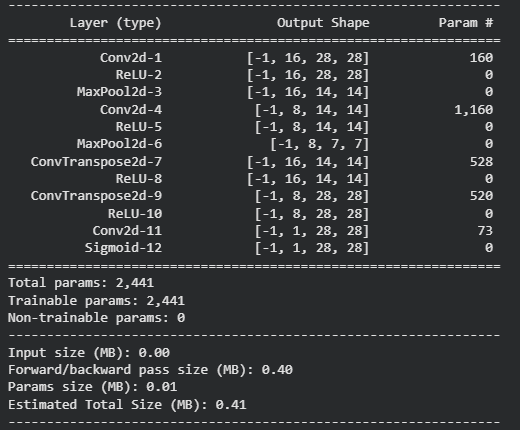
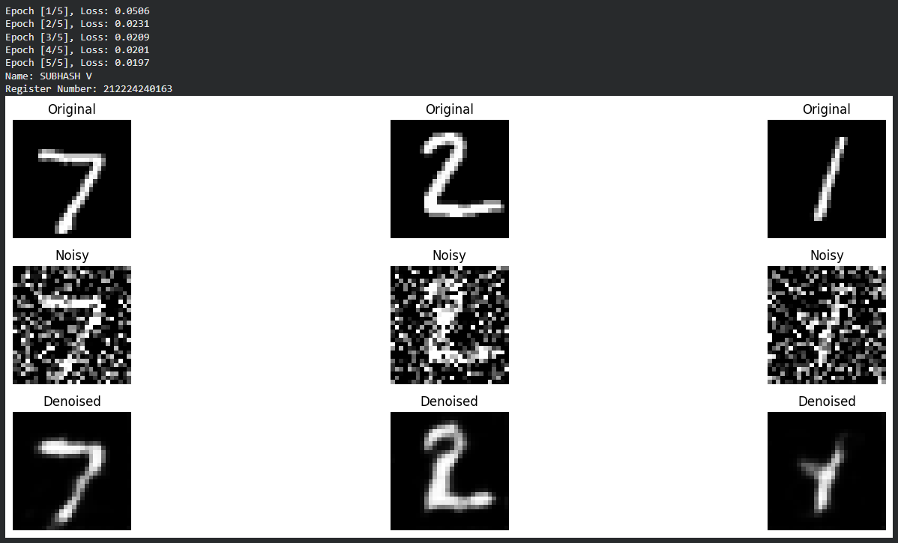

# Image Denoising Using Convolutional Autoencoder

## AIM

To create a convolutional autoencoder that can effectively remove noise from images.

## Problem Overview and Dataset

In practical scenarios, images often contain noise that degrades the performance of computer vision models. A convolutional autoencoder learns compressed representations of images and reconstructs them, which can be used to remove noise.

* **Dataset:** MNIST (28×28 grayscale images of handwritten digits)
* **Noise:** Gaussian noise will be added to simulate real-world scenarios

## Implementation Steps

### Step 1: Setup Environment

Import required libraries: PyTorch, torchvision, matplotlib, and others for data handling and visualization.

### Step 2: Load Dataset

Download the MNIST dataset and apply transformations to convert images to tensors suitable for training.

### Step 3: Introduce Noise

Add Gaussian noise to the training and testing images using a custom noise-adding function.

### Step 4: Define Autoencoder Architecture

* **Encoder:** Convolutional layers (Conv2D) with ReLU activations and MaxPooling
* **Decoder:** Transposed convolutional layers (ConvTranspose2D) with ReLU and Sigmoid activations to reconstruct the image

### Step 5: Prepare Training

* Initialize the autoencoder model
* Define Mean Squared Error (MSE) as the loss function
* Choose Adam optimizer for training

### Step 6: Model Training

Train the autoencoder using the noisy images as input and the original clean images as the target. Track the loss over epochs to monitor learning.

### Step 7: Evaluate and Visualize

* Compare the original, noisy, and denoised images
* Visualize results to assess the model’s performance in removing noise

---

## PROGRAM
### Name: SUBHASH V
### Register Number: 212224240163
```PYTHON
#model function
class DenoisingAutoencoder(nn.Module):
    def __init__(self):
        super(DenoisingAutoencoder, self).__init__()
        self.encoder = nn.Sequential(
            nn.Conv2d(1, 16, 3, padding=1),  
            nn.ReLU(),
            nn.MaxPool2d(2, 2),             
            nn.Conv2d(16, 8, 3, padding=1), 
            nn.ReLU(),
            nn.MaxPool2d(2, 2)              
        )
        self.decoder = nn.Sequential(
            nn.ConvTranspose2d(8, 16, 2, stride=2),    
            nn.ReLU(),
            nn.ConvTranspose2d(16, 8, 2, stride=2),    
            nn.ReLU(),
            nn.Conv2d(8, 1, 3, padding=1),            
            nn.Sigmoid()
        )

    def forward(self, x):
        x = self.encoder(x)
        x = self.decoder(x)
        return x


# Initialize model, loss function and optimizer
model = DenoisingAutoencoder().to(device)
criterion = nn.MSELoss()
optimizer = optim.Adam(model.parameters(), lr=0.001)


# Training Function
def train(model, loader, criterion, optimizer, epochs=5):
    model.train()
    for epoch in range(epochs):
        running_loss = 0.0
        for images, _ in loader:
            images = images.to(device)
            noisy_images = add_noise(images).to(device)

            outputs = model(noisy_images)
            loss = criterion(outputs, images)

            optimizer.zero_grad()
            loss.backward()
            optimizer.step()

            running_loss += loss.item()
        print(f"Epoch [{epoch+1}/{epochs}], Loss: {running_loss/len(loader):.4f}")


```

## OUTPUT

### Model Summary



### Original vs Noisy Vs Reconstructed Image



## RESULT

The convolutional autoencoder was successfully trained to denoise MNIST digit images. The model effectively reconstructed clean images from their noisy versions, demonstrating its capability in feature extraction and noise reduction.
